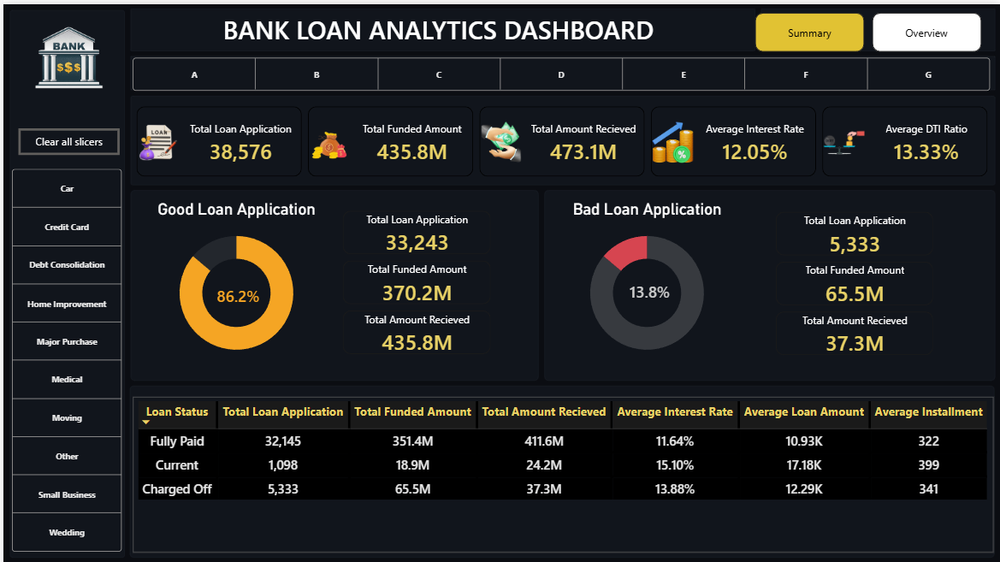
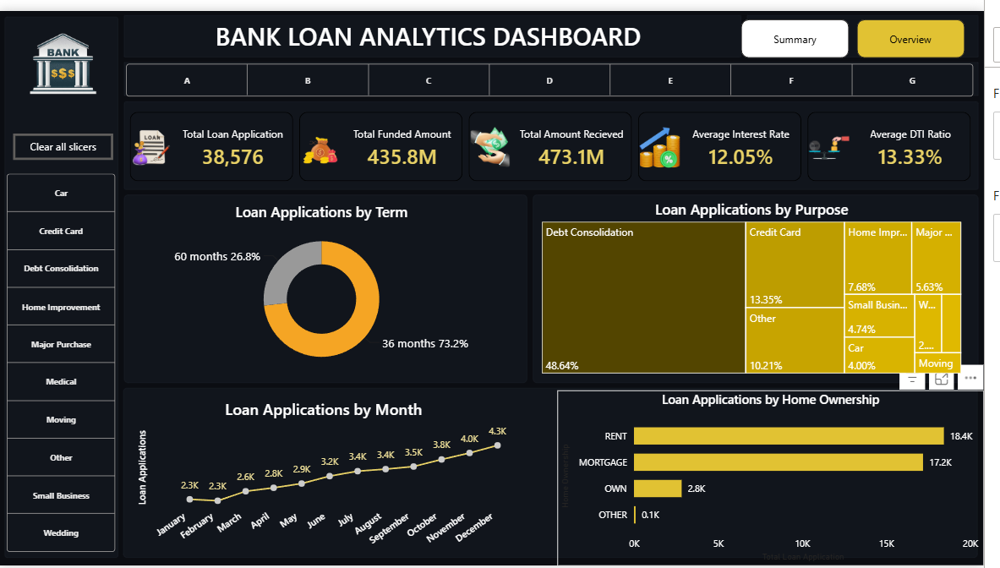

# 🏦 Bank Loan Analytics Dashboard

## Overview
An interactive two-page Power BI dashboard analyzing 38,576 
bank loan applications to monitor portfolio health, identify 
loan performance trends and classify loans as Good or Bad.

## Dashboard Pages

### Page 1 — Summary


- KPI cards showing total applications, funded amount, 
  amount received, average interest rate and DTI ratio
- Good Loan vs Bad Loan classification with donut charts
- Loan status breakdown table (Fully Paid, Current, Charged Off)
- Slicers for filtering by loan purpose

### Page 2 — Overview


- Loan applications by term (36 vs 60 months)
- Loan applications by purpose (treemap)
- Monthly loan application trend (line chart)
- Loan applications by home ownership (bar chart)

## Key Metrics
| Metric | Value |
|---|---|
| Total Loan Applications | 38,576 |
| Total Funded Amount | 435.8M |
| Total Amount Received | 473.1M |
| Average Interest Rate | 12.05% |
| Average DTI Ratio | 13.33% |
| Good Loan % | 86.2% |
| Bad Loan % | 13.8% |

## Loan Classification Logic
- ✅ **Good Loan** = Fully Paid + Current status
- ❌ **Bad Loan** = Charged Off status

## DAX Measures
```dax
Total Loan Application = COUNT(financial_loan[ID])

Total Funded Amount = SUM(financial_loan[LOAN_AMOUNT])

Total Amount Received = SUM(financial_loan[TOTAL_PAYMENT])

Average Interest Rate = AVERAGE(financial_loan[INT_RATE])

Average DTI Ratio = AVERAGE(financial_loan[DTI])

Good Loan Count = 
CALCULATE(
    'Table'[Total Loan Application],
    financial_loan[Good_or_bad_loan] = "Good"
)

Good Loan Percentage = 
DIVIDE('Table'[Good Loan Count], 'Table'[Total Loan Application])

Bad Loan Count = 
CALCULATE(
    'Table'[Total Loan Application],
    financial_loan[Good_or_bad_loan] = "Bad"
)

Bad Loan Percentage = 
DIVIDE('Table'[Bad Loan Count], 'Table'[Total Loan Application])
```

## Key Insights
- **86.2%** of all loans are Good Loans showing a 
  healthy loan portfolio
- **Debt Consolidation** is the most common loan purpose 
  at 48.64% of all applications
- Loan applications show a **steady upward trend** 
  month over month peaking in December at 4.3K
- **73.2%** of borrowers prefer 36 month term over 60 months
- **RENT** is the most common home ownership status 
  among borrowers (18.4K)

## Tools Used
- Power BI Desktop
- DAX (Data Analysis Expressions)
- Excel (data source)

## Files
- `Bank_Loan_Analytics.pbix` — Power BI dashboard file
- `Financial_loan_data.xlsx` — Raw dataset
- `Summary.png` — Dashboard Page 1 screenshot
- `Overview.png` — Dashboard Page 2 screenshot
